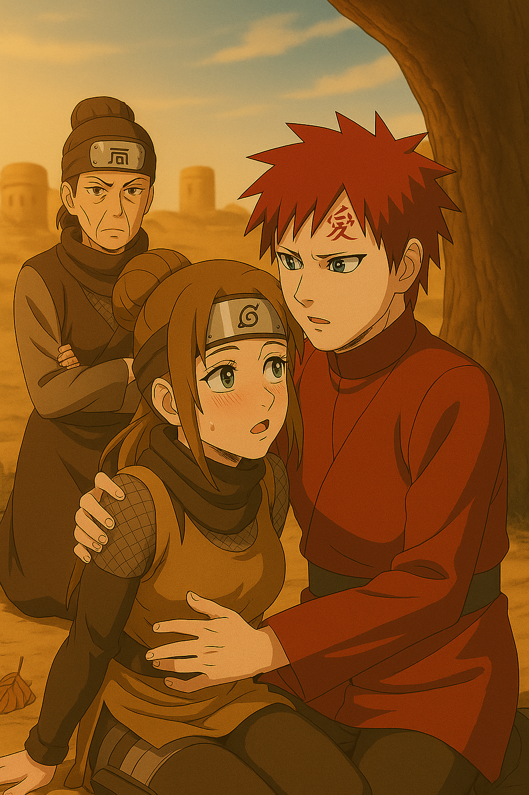

## Gara's Flight to Leaf Village
Gara woke up late in the morning it is already 10:010 AM and flight is at 11:00 AM it is so late. Gara in hurry and tension in his face.

He quickly went to mirror and getting ready. Meanwhile Naruto called Gara and he feels shameful for being late.
 
**Gara:** Sorry naruto, my clock is not working properly may be. 

**Naruto:** 😡😡 It is already *10:10 AM* Gara. Although you have become Kazekage (風影) but this doesn't mean I can pardon you. We are afterall friends as before. `Ya know`?

**Gara:** Yeah, yeah ofcourse Naruto. I set alarm at 6:00 AM but don't know what happened?😟😟

**Naruto:** 😡😡I think your clock got stuck in your sandy weathers. `In mind: Gara, you slept well I think for the first time as the one tailed came out of you. Sorry Gara, I disturbed you😌`

---
## Scene Changes
> Gara is ready to depart for airport to take flight for leaf village.
> His mistress `dadi` Rika stopped him to give some tips about to be safe in the journey.

**Rika:** Hello Gara. You are about to leave huh?
**Gara:** Yes Lady Rika.
**Rika:** Are you feeling weak?
**Gara:** No. But..
**Rika:** What is it Gara?
**Gara:** I think I am not as strong as before. When one tailed was inside me I used to feel protected. 
**Rika:** Gara...! Listen, when even one tailed inside you, you felt pain while fighting to Lee. Can you remember? But What is the real protection from pain you think of? Being lonely from the world and feel self contained and work for only yourself? Or, feel the pain and find happiness in between pain while serving for your closed ones like Naruto told you? 
**Gara:** [`Paused a bit! Silence..`] Yeah, I felt that day a severe pain in my head when fighting Naruto Uzumaki huh. He gave me much more physical damage and I also gave him. We were tired completely. But I could not resist the pain as my body got weak and I was only thiking about my body and not willing to give harm to it. But he still was crawling towards me.

That time I could not understood how he could do it? I thought later may be it was due to the beast inside him or he was more strong than me. But now I realise what gave him that resiliance. How he can always fight back. To protect his beloved ones. I understood it. In these days I really need to talk to him to know more about these ultimate power of relationship. So, I am going to meet him. I will be back soon.

> From behind the trees Sazami waticng. She thought to meet Gara before he leaves. But resisted herself. Understand the depth of Gara's feeling. She decided to wait for Gara to return. May be she understood Naruto will teach Gara about romantic relationship too.

> Her feet fells on a dry leaf and gentle sound make both Rika and Gara alert. They look at the tree side and trying to hide Sazami gets stumbled.

> Sizami is sitting on the ground. Her  leg is aching. Tears in her eyes. Gara and Rika in curiosity running towards her.

> Gara came near Sizame and wanted to look at what happened to her. That time Gara got too close to Sazami to see her wound in her legs. Sazami could not take control on her feel on Gara. They looked at each other. A romantic eye contact occurs. Gara is so confused. Sazami feeling the blush and race in her heart.

## Next Scene at Airport:
> Gara is about to leave sand village. Waving each other good bye.
> 
